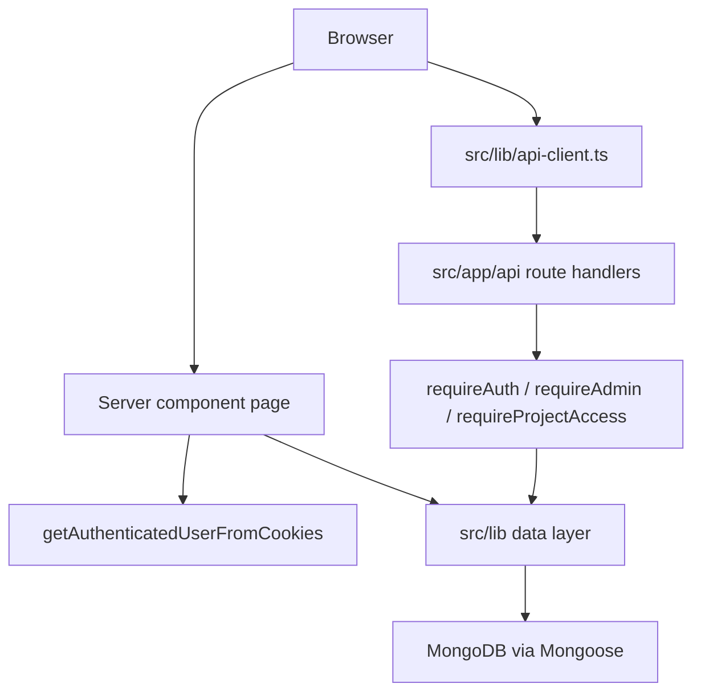

# Architecture

Technical design for the task-management application: stack, code organization, authentication, data layer, business rules, and build order.

**Related documentation**

- [App structure](APP_STRUCTURE.md)
- [UI guide](UI.md)
- [API reference](API.md)
- [Running and usage](RUNNING.md)

---

## Technology stack

| Layer | Choice |
|-------|--------|
| Framework | Next.js 14.2 (App Router) |
| UI | React 18, Tailwind CSS 3.4 |
| Language | TypeScript 5 |
| Database | MongoDB 6+ via Mongoose 9 |
| Authentication | JWT (`jose`, HS256) in httpOnly cookie |
| Password hashing | Node.js `crypto.scrypt` |
| Drag and drop | `@dnd-kit` v6 |
| Locale | Hebrew RTL — `lang="he" dir="rtl"` |
| Font | Rubik via `next/font/google` |

---

## Directory layout

```
src/
├── app/
│   ├── api/              # Route handlers (REST)
│   ├── notes/page.tsx    # Sticky notes page (server gate)
│   ├── users/page.tsx    # User admin (server gate)
│   ├── page.tsx          # Home / login / board
│   ├── layout.tsx        # RTL shell, theme, toasts
│   └── globals.css
├── components/           # React UI (~52 components)
├── hooks/
│   ├── usePresence.ts
│   └── useTaskTableColumns.ts
└── lib/
    ├── models/           # Mongoose schemas (7 models)
    ├── auth.ts           # JWT, cookies, guards
    ├── password.ts       # scrypt hash/verify
    ├── mongodb.ts        # Cached connection
    ├── projectAccess.ts  # Board permission checks
    ├── tasks.ts          # Task CRUD and validation
    ├── projects.ts       # Project CRUD
    ├── customColumns.ts  # Column CRUD
    ├── boardNotes.ts     # Sticky note CRUD
    ├── users.ts          # User CRUD
    ├── sessions.ts       # Presence logic
    ├── api-client.ts     # Browser fetch helpers
    ├── types.ts          # Shared TypeScript types
    └── utils.ts          # Constants and helpers

scripts/
├── create-user.ts
├── clear-sessions.ts
└── clear-tasks.ts

public/
├── avatars/              # Presence images
├── docs/import-tasks.md
└── notes-icon.png
```

---

## Request flow



### Server vs client

- **Server components** (`page.tsx` files): authentication gate, initial data load, redirect on denied access
- **Client components** (`"use client"`): interactive board, forms, drag-and-drop, presence heartbeat
- **API routes**: all mutations and client-initiated reads

---

## Authentication

### Login flow

1. `POST /api/auth/login` with `{ username, password }`
2. Look up user in MongoDB; verify password against `passwordHash`
3. Sign JWT: payload `{ username, role }`, subject = user `_id`, HS256, 7-day expiry
4. Set httpOnly cookie `auth_token` (secure in production, sameSite `lax`)
5. Return `{ user: { username, role } }`

### Password storage

- Algorithm: scrypt with random 16-byte salt
- Stored format: `{saltHex}:{derivedKeyHex}`
- Verification uses `timingSafeEqual`

### Guards

| Guard | Location | Behavior |
|-------|----------|----------|
| `requireAuth` | `src/lib/auth.ts` | Valid JWT; 401 if missing |
| `requireAdmin` | `src/lib/auth.ts` | Authenticated + `role === "admin"`; 403 otherwise |
| `requireProjectAccess` | `src/lib/projectAccess.ts` | User may access given `projectId`; admins always pass |

### Environment

| Variable | Requirement |
|----------|-------------|
| `JWT_SECRET` | Minimum 32 characters |
| `MONGODB_URI` | MongoDB connection string |

---

## Board access

Stored on `User.allowedProjectIds`:

| Value | Meaning |
|-------|---------|
| `null` | Access all boards |
| `[]` | No boards |
| `[1, 3, …]` | Only listed `projectId`s |

`getProjectsForUser()` filters the project list on the home page. API routes for notes and task reads call `requireProjectAccess`.

---

## Data model

All models use Mongoose `timestamps: true`. Business IDs (`taskId`, `projectId`, etc.) are numeric counters separate from MongoDB `_id`.

### User

| Field | Type | Default | Notes |
|-------|------|---------|-------|
| `username` | String | — | unique, indexed, trimmed |
| `passwordHash` | String | — | scrypt format |
| `role` | String | — | `admin` \| `user` |
| `allowedProjectIds` | [Number] | `null` | board access |

### Project

| Field | Type | Default | Notes |
|-------|------|---------|-------|
| `projectId` | Number | — | unique, indexed |
| `name` | String | — | max 50, trimmed |
| `sortOrder` | Number | `0` | indexed |

Deleting a project removes its tasks, custom columns, and board notes.

### Task

| Field | Type | Default | Notes |
|-------|------|---------|-------|
| `projectId` | Number | — | indexed |
| `taskId` | Number | — | globally unique, indexed |
| `title` | String | — | max 70 |
| `priority` | String | — | enum: priorities |
| `details` | String | — | required |
| `status` | String | `ממתין להתחלה` | enum: statuses |
| `notes` | String | `""` | per-task notes |
| `parentTaskId` | Number | `null` | indexed; one subtask level |
| `sortOrder` | Number | `0` | indexed |
| `customFields` | Map\<String\> | `{}` | keyed by column ID string |

**Rules:**

- `taskId` is globally unique across all projects
- Parent status is derived from subtask statuses when subtasks exist
- Subtasks cannot nest further

### CustomColumn

| Field | Type | Default | Notes |
|-------|------|---------|-------|
| `columnId` | Number | — | unique, indexed |
| `projectId` | Number | — | indexed |
| `name` | String | — | max 50 |
| `type` | String | — | `text` \| `number` \| `date` \| `link` |
| `sortOrder` | Number | `0` | indexed |

Deleting a column removes `customFields.{columnId}` from all project tasks.

### BoardNote

| Field | Type | Default | Notes |
|-------|------|---------|-------|
| `noteId` | Number | — | unique, indexed |
| `projectId` | Number | — | indexed |
| `content` | String | `""` | max 2000 |
| `color` | String | `yellow` | yellow, green, blue, pink, purple |
| `x`, `y` | Number | `40` | canvas position (px) |
| `width` | Number | `240` | px |
| `height` | Number | `120` | px |
| `zIndex` | Number | `1` | bumped on drag |

Namespace `BoardNote` is distinct from `Task.notes`.

### VisitorSession

| Field | Type | Notes |
|-------|------|-------|
| `sessionId` | String | unique, indexed |
| `nameResource` | ObjectId | ref PresenceResource |
| `avatarResource` | ObjectId | ref PresenceResource |
| `lastSeenAt` | Date | indexed |

### PresenceResource

| Field | Type | Default | Notes |
|-------|------|---------|-------|
| `resourceId` | Number | — | |
| `type` | String | — | `avatar` \| `name` |
| `label` | String | `""` | display name |
| `imagePath` | String | `""` | e.g. `/avatars/3.png` |
| `assignedSessionId` | String | `null` | indexed |
| `assignedAt` | Date | `null` | |

Compound indexes: `{ type, resourceId }` unique; `{ type, assignedSessionId }`.

---

## Presence system

- 20 Hebrew display names and 12 avatar images assigned randomly per session
- Client stores `sessionId` in `sessionStorage` (`tasks-tracker-session-id`)
- Heartbeat: `POST /api/sessions/sync` every 30 seconds
- Sessions stale after 30 seconds without heartbeat
- Maximum 12 concurrent online users
- `OnlineUsers` component renders avatar strip with name tooltips

---

## Client storage

| Key | Storage | Purpose |
|-----|---------|---------|
| `theme` | localStorage | Dark/light mode |
| `task-table-column-widths` | localStorage | Resizable column widths |
| `activeProjectId` | cookie (client, 1 year) | Last selected board |
| `auth_token` | httpOnly cookie (server, 7 days) | JWT session |
| `tasks-tracker-session-id` | sessionStorage | Presence session |

Table columns: `#`, `סטטוס`, `משימה`, `עדיפות`, `פירוט`, `פעולות` — resizable except `פעולות`. Custom columns fixed at 140 px width.

---

## Import/export format

Export includes: `title`, `priority`, `details`, `status`, `notes`, `subtasks`. Excludes `taskId`, `sortOrder`, `customFields`, timestamps.

```json
{
  "tasks": [
    {
      "title": "משימה ראשית",
      "priority": "גבוה",
      "details": "תיאור",
      "status": "ממתין להתחלה",
      "notes": "",
      "subtasks": [
        {
          "title": "תת-משימה",
          "priority": "בינוני",
          "details": "פירוט",
          "status": "ממתין להתחלה"
        }
      ]
    }
  ]
}
```

Import accepts `{ "tasks": [...] }` or a bare array. Appends tasks; assigns next `taskId` and `sortOrder`. See `public/docs/import-tasks.md` for validation rules.

---

## Implementation phases

Build in this order. Each phase should compile and run before starting the next.

| Phase | Deliverable |
|-------|-------------|
| 1 | Next.js scaffold: TypeScript, Tailwind (`darkMode: "class"`), `@/*` path alias |
| 2 | RTL layout, Rubik font, theme provider, toast provider |
| 3 | MongoDB connection cache, seven Mongoose models, shared types and constants |
| 4 | Auth: scrypt, JWT cookie, login/logout/me routes, login page, guards |
| 5 | Projects and tasks: CRUD lib, API routes, board UI (table + cards), filters, metrics |
| 6 | Custom columns: CRUD, typed cells, drag-reorder headers |
| 7 | Board notes: `/notes` page, canvas, drag, resize, linkify |
| 8 | Users and board permissions: `/users` page, `allowedProjectIds` filtering |
| 9 | Presence: sync API, heartbeat hook, online users strip |
| 10 | Import/export: JSON download and append import |

---

## Licensing

| Item | License / status |
|------|------------------|
| This repository | No LICENSE file; `private: true` — proprietary unless a license is added |
| npm dependencies | Mostly MIT; TypeScript Apache-2.0; dotenv BSD-2-Clause |
| Rubik font | SIL Open Font License 1.1 |
| MongoDB Community | SSPL-1.0 (self-hosted) |
| MongoDB Atlas | Commercial terms |
| `public/avatars/*.png`, `public/notes-icon.png` | Provenance not documented — replace with licensed assets when redistributing |

Verify dependency licenses after upgrades: `npx license-checker --summary`

---

## Known caveats

- `npm run seed` references missing `scripts/seed.ts`
- Empty directory `src/app/api/projects/[projectId]/` should be removed
- `GET /api/projects/[id]/columns` uses `requireAuth` but not `requireProjectAccess`
- Some admin task routes omit explicit board-access checks
- Models call `mongoose.deleteModel()` in development for hot-reload compatibility
- `Task.notes` (table field) and `BoardNote` (sticky notes page) are separate features
