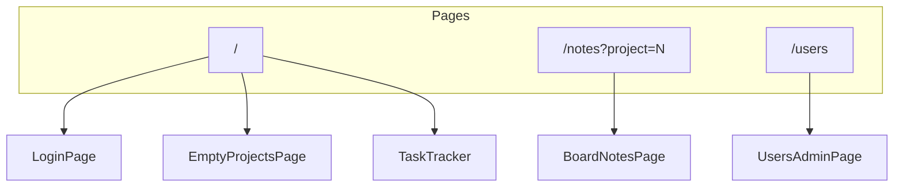

# UI Guide

Complete UI structure, component hierarchy, design tokens, layout wireframes, and interaction patterns for rebuilding the interface.

**Related documentation**

- [App structure](APP_STRUCTURE.md)
- [Architecture](ARCHITECTURE.md)
- [API reference](API.md)
- [Running and usage](RUNNING.md)

---

## Global shell

Every page shares the same root setup:

```
html[lang=he dir=rtl]
└── body (Rubik, antialiased)
    └── ThemeProvider
        └── ToastProvider
            └── page content
```

| File | Role |
|------|------|
| `src/app/layout.tsx` | RTL document, Rubik font, wraps providers |
| `src/components/ThemeProvider.tsx` | Light/dark toggle via `html.dark` class |
| `src/components/Toast.tsx` | Bottom-right toast stack, 3 s auto-dismiss |
| `src/app/globals.css` | Body colors, scrollbar, table cell borders |

### Theme

- **Mode:** `class` strategy on `<html>` (`tailwind.config.ts`)
- **Storage:** `localStorage.theme` = `"light"` \| `"dark"`
- **Initial:** stored value, else `prefers-color-scheme`
- **Hydration:** placeholder `min-h-screen bg-slate-50 dark:bg-slate-900` until mounted

### Toast placement

- Fixed `bottom-5 right-5 z-50`
- Types: success (emerald), error (rose), info (indigo)

---

## Design system

### Typography

| Use | Classes |
|-----|---------|
| Page title | `text-xl`–`text-2xl font-bold` |
| Section label | `text-xs font-semibold uppercase tracking-wider text-slate-400` |
| Body / inputs | `text-sm` |
| Micro badges | `text-[10px] font-semibold` |

Font: **Rubik** (weights 300, 400, 500, 700), Hebrew + Latin subsets.

### Color palette (Tailwind)

| Role | Light | Dark |
|------|-------|------|
| Page background | `bg-slate-50` | `bg-slate-900` |
| Surface (cards, header) | `bg-white` | `bg-slate-800` |
| Borders | `border-slate-200` | `border-slate-700` |
| Primary action | `bg-indigo-600 hover:bg-indigo-700` | same |
| Accent / active tab | `indigo-50`, `indigo-300` border | `indigo-950/40`, `indigo-700` |
| Success / progress | `emerald-500`, `emerald-600` | lighter emerald text |
| Danger | `red-600`, `red-50` backgrounds | `red-950/30` |
| Muted text | `text-slate-400`, `text-slate-500` | `text-slate-400` |

Brand accent in header icon: **emerald** (`bg-emerald-100 text-emerald-600`).

### Spacing and layout

| Token | Value |
|-------|-------|
| Max content width | `max-w-6xl mx-auto px-4` |
| Section gap | `gap-6` in main columns |
| Card padding | `p-4`–`p-6` |
| Border radius | `rounded-xl` (cards), `rounded-2xl` (modals) |
| Shadow | `shadow-sm` on cards, `shadow-xl` on modals |

### Status badge colors (`getStatusBadgeClass`)

| Status | Style |
|--------|-------|
| ממתין להתחלה | Slate |
| בטיפול | Amber |
| הושלם | Emerald |

### Priority badge colors (`getPriorityBadgeClass`)

| Priority | Style | Emoji |
|----------|-------|-------|
| קריטי | Red | 🚨 |
| גבוה | Amber | ⚡ |
| בינוני | Blue | 📋 |
| נמוך | Slate | ⬇️ |

### Sticky note colors (`NOTE_COLOR_STYLES`)

| Key | Header | Body |
|-----|--------|------|
| yellow | `bg-yellow-300` | `bg-yellow-100` |
| green | `bg-green-300` | `bg-green-100` |
| blue | `bg-sky-300` | `bg-sky-100` |
| pink | `bg-pink-300` | `bg-pink-100` |
| purple | `bg-purple-300` | `bg-purple-100` |

Dark mode uses `-950/60` tints on bodies and darker `-600` headers.

### Breakpoints

| Breakpoint | Behavior |
|------------|----------|
| `< md` (< 768px) | `TaskCards` visible; table hidden; notes stacked; header stacks vertically |
| `≥ md` | `TaskTable` visible; cards hidden; notes free-position canvas |

Notes mobile detection: `useIsMobileNotesLayout()` — `window.matchMedia("(max-width: 767px)")`.

---

## Page map



| Route | Server page | Client root | Condition |
|-------|-------------|-------------|-----------|
| `/` | `page.tsx` | `LoginPage` | Not authenticated |
| `/` | `page.tsx` | `EmptyProjectsPage` | No projects |
| `/` | `page.tsx` | `TaskTracker` | Has projects |
| `/notes` | `notes/page.tsx` | `BoardNotesPage` | Authenticated + board access |
| `/users` | `users/page.tsx` | `UsersAdminPage` | Admin only |

---

## Page wireframes

### Login (`LoginPage`)

```
┌─────────────────────────────────────┐
│         [clipboard icon]            │
│         Tasks Tracker               │
│   התחבר כדי לצפות בלוח המשימות      │
│                                     │
│   שם משתמש    [____________]        │
│   סיסמה       [____________]        │
│   [error message if any]            │
│   [        התחבר        ]           │
└─────────────────────────────────────┘
```

Centered card on full-screen slate background. No header.

---

### Main board (`TaskTracker`)

```
┌─ Header ─────────────────────────────────────────────────────────┐
│ [icon] Tasks Tracker    [OnlineUsers avatars…]                   │
│        subtitle          ניהול משתמשים | user מנהל | התנתק | 🌙  │
├─ ProjectListBar ─────────────────────────────────────────────────┤
│ [Board A*] [Board B] [✎][×]  [Board C] …  [+]                    │
├─ main (max-w-6xl) ───────────────────────────────────────────────┤
│                                          [notes icon + badge]    │
│ ┌─ MetricsDashboard (if tasks) ────────────────────────────────┐ │
│ │ progress card (2 cols) │ critical │ high │ medium             │ │
│ └──────────────────────────────────────────────────────────────┘ │
│ ┌─ FiltersBar ─────────────────────────────────────────────────┐ │
│ │ [search…] [priority ▼] [all|open|done status pills]  count   │ │
│ └──────────────────────────────────────────────────────────────┘ │
│ ┌─ SubtaskBulkBar ─────────────────────────────────────────────┐ │
│ │ [⋮ menu] [☑ בחר הכל]              [סגור הכל] [מחק]         │ │
│ └──────────────────────────────────────────────────────────────┘ │
│ ┌─ TaskTable (md+) ────────────────────────────────────────────┐ │
│ │ # │ status │ task │ priority │ details │ actions │ custom…  │ │
│ │ rows + expandable subtask sections + add row                 │ │
│ └──────────────────────────────────────────────────────────────┘ │
│ ┌─ TaskCards (< md) ───────────────────────────────────────────┐ │
│ │ stacked TaskCard components + AddTaskMobileBar               │ │
│ └──────────────────────────────────────────────────────────────┘ │
├─ footer ─────────────────────────────────────────────────────────┤
│                    לוח משימות • 2026                             │
└──────────────────────────────────────────────────────────────────┘
```

Modals (portals/overlays on top): add task, import, delete, edit field, celebration trophy.

---

### Board notes (`BoardNotesPage`)

```
┌─ Header (same as board) ─────────────────────────────────────────┐
├─ main ────────────────────────────────────────────────────────────┤
│ ← חזרה ללוח                                                       │
│ פתקים — {board name}                                              │
│ helper text (admin vs viewer)                    [+ פתק חדש]     │
│ ┌─ canvas (min-h ~70vh, dotted grid bg) ────────────────────────┐ │
│ │  [StickyNote] [StickyNote] …  (absolute positioned on desktop)│ │
│ │  or stacked cards on mobile                                   │ │
│ └───────────────────────────────────────────────────────────────┘ │
└───────────────────────────────────────────────────────────────────┘
```

---

### Users admin (`UsersAdminPage`)

```
┌─ Header ─────────────────────────────────────────────────────────┐
├─ main ────────────────────────────────────────────────────────────┤
│ ← חזרה ללוח                                                       │
│ ניהול משתמשים                                    [+ משתמש חדש]   │
│ ┌─ table ────────────────────────────────────────────────────────┐ │
│ │ username │ role │ boards │ created │ updated │ actions        │ │
│ └───────────────────────────────────────────────────────────────┘ │
└───────────────────────────────────────────────────────────────────┘
```

---

### Empty projects (`EmptyProjectsPage`)

Header + centered card: **אין לוחות עדיין**. Admin sees create form; viewer sees contact-admin message.

---

## Component tree

### Application-level

```
layout.tsx
├── ThemeProvider
│   └── ToastProvider
│       ├── LoginPage
│       ├── EmptyProjectsPage
│       │   └── Header
│       ├── TaskTracker                    ← main orchestrator
│       ├── BoardNotesPage
│       └── UsersAdminPage
```

### TaskTracker subtree

```
TaskTracker
├── Header
│   └── OnlineUsers
│       └── usePresence → /api/sessions/sync
├── ProjectListBar
│   ├── CreateProjectModal
│   ├── EditProjectModal
│   └── DeleteProjectModal
├── Link (notes icon + badge)
├── MetricsDashboard
├── FiltersBar
├── SubtaskBulkBar
├── TaskTable                          hidden md:block
│   ├── ResizableTableHeader ×6
│   ├── CustomColumnHeader ×N
│   ├── SortableTaskRow → TaskRow
│   │   └── SubtaskSection (when expanded)
│   │       └── SubtaskRow(s)
│   ├── AddTaskTableRow
│   └── AddCustomColumnModal
├── TaskCards                          block md:hidden
│   ├── SortableTaskCard → TaskCard
│   │   └── SubtaskCardList
│   └── AddTaskMobileBar
├── AddTaskModal
├── ImportTasksModal
├── DeleteTaskModal
├── DeleteSelectedTasksModal
├── EditTaskFieldModal
└── Modal (celebration)
```

### TaskRow cell composition

```
TaskRow (table row)
├── DragHandle (if canReorder)
├── TaskSelectCheckbox (bulk bar mode)
├── # taskId
├── StatusSelect | SubtaskStatusSummary (if has subtasks)
├── TaskTitleDisplay + EditPencilButton (title)
├── PrioritySelect
├── TruncatedDetails + EditPencilButton (details)
├── CustomFieldCells (per custom column)
├── NoteIcon → expands notes textarea row
├── SubtaskToggleButton
├── DeleteButton
└── [expanded notes row colspan]
```

### Shared primitives

| Component | Purpose |
|-----------|---------|
| `Modal` | Overlay + close button (top-left in RTL = visual top-left) |
| `DragHandle` | Six-dot grip for @dnd-kit |
| `EditPencilButton` | Small pencil icon button |
| `StatusSelect` | Inline status dropdown with badge styling |
| `PrioritySelect` | Inline priority dropdown with emoji |
| `TaskSelectCheckbox` | Bulk selection checkbox |
| `TruncatedDetails` | Line-clamped details with expand |
| `NoteIcon` | Sticky-note icon; filled when notes exist |

---

## Full component catalog

All files under `src/components/` (~50 components):

| Component | Used on | Admin only? |
|-----------|---------|-------------|
| `AddCustomColumnModal` | Task table header | Yes |
| `AddTaskMobileBar` | Mobile cards view | Yes |
| `AddTaskModal` | Subtask / modal add | Yes |
| `AddTaskTableRow` | Table bottom inline add | Yes |
| `BoardNotesPage` | `/notes` | — |
| `CreateProjectModal` | ProjectListBar | Yes |
| `CreateUserModal` | Users admin | Yes |
| `CustomColumnHeader` | Table header | Yes (delete/reorder) |
| `CustomFieldCell` | Table cells | Edit: admin |
| `DeleteAllTasksModal` | (if wired) | Yes |
| `DeleteProjectModal` | ProjectListBar | Yes |
| `DeleteSelectedTasksModal` | Bulk delete | Yes |
| `DeleteTaskModal` | Row delete confirm | Yes |
| `DeleteUserModal` | Users admin | Yes |
| `DragHandle` | Rows, notes | Admin + desktop |
| `EditPencilButton` | Title, details, projects | Admin |
| `EditProjectModal` | ProjectListBar | Yes |
| `EditTaskFieldModal` | Title/details edit | Yes |
| `EditUserModal` | Users admin | Yes |
| `EmptyProjectsPage` | No projects | — |
| `FiltersBar` | TaskTracker | — |
| `Header` | All authenticated pages | — |
| `ImportTasksModal` | Import JSON paste | Yes |
| `LoginPage` | `/` logged out | — |
| `MetricsDashboard` | TaskTracker | — |
| `Modal` | Generic shell | — |
| `NoteIcon` | Task rows | — |
| `OnlineUsers` | Header | — |
| `PrioritySelect` | Task rows | Edit: admin |
| `ProjectListBar` | TaskTracker | Create/edit: admin |
| `ResizableTableHeader` | Table columns | Admin resize |
| `StatusSelect` | Task rows | Edit: admin |
| `StickyNote` | Board notes | Edit: admin |
| `SubtaskBulkBar` | Above task list | Partial |
| `SubtaskCardList` | Mobile cards | — |
| `SubtaskSection` | Table subtask rows | — |
| `SubtaskStatusSummary` | Parent status rollup display | — |
| `SubtaskToggleButton` | Expand subtasks | — |
| `TaskCard` | Mobile view | — |
| `TaskCards` | Mobile list wrapper | — |
| `TaskRow` | Desktop table row | — |
| `TaskSelectCheckbox` | Bulk selection | Admin |
| `TaskTable` | Desktop table wrapper | — |
| `TaskTitleDisplay` | Title cell | — |
| `TaskTracker` | Main board page | — |
| `ThemeProvider` | Root layout | — |
| `Toast` | Root layout | — |
| `TruncatedDetails` | Details cell | — |
| `UserBoardPermissions` | User modals | Admin |
| `UsersAdminPage` | `/users` | Admin page |

### Hooks

| Hook | File | Purpose |
|------|------|---------|
| `useTaskTableColumns` | `hooks/useTaskTableColumns.ts` | Column widths, localStorage persist, resize drag |
| `usePresence` | `hooks/usePresence.ts` | Session heartbeat, online users list |
| `useTheme` | `ThemeProvider.tsx` | Dark/light toggle |
| `useToast` | `Toast.tsx` | Show notifications |
| `useIsMobileNotesLayout` | `StickyNote.tsx` | Notes page responsive mode |

---

## State ownership

`TaskTracker` is the **single orchestrator** for the main board. It holds:

| State | Purpose |
|-------|---------|
| `projects`, `activeProjectId` | Board tabs |
| `tasks`, `customColumns` | Task board data |
| `filterStatus`, `filterPriority`, `searchQuery` | Filters |
| `expandedTaskId` | Per-task notes row |
| `expandedSubtaskParents` | Which parents show subtask rows |
| `selectedSubtaskParents` | Bulk selection set |
| `activeModal` | `celebration` \| `addTask` \| `importTasks` |
| `taskToDelete`, `editField`, `deleteSelectedOpen` | Modal targets |
| `addTaskExpanded` | Inline add row |
| `boardNotesCount` | Notes icon badge |
| `noteTimers`, `customFieldTimers` | Debounced PATCH refs |

Child components are **presentational** — they receive callbacks and render UI. No task data fetching inside table/card components.

`BoardNotesPage` and `UsersAdminPage` own their own local state with server-provided initial data.

---

## Interaction patterns

### Debounced saves (500 ms)

| Field | Location | API |
|-------|----------|-----|
| Task `notes` | TaskTracker `handleNoteChange` | `PATCH /api/tasks/[id]` |
| Custom column values | TaskTracker `handleCustomFieldChange` | `PATCH /api/tasks/[id]` |
| Sticky note content | BoardNotesPage `handleContentChange` | `PATCH .../notes/[noteId]` |

On error: revert local state + error toast.

### Drag and drop (`@dnd-kit`)

| Context | Strategy | When enabled |
|---------|----------|--------------|
| Top-level tasks | `verticalListSortingStrategy` | Admin, no filters active |
| Subtasks | Same, nested in `SubtaskSection` | Same |
| Custom columns | `horizontalListSortingStrategy` | Admin, 2+ columns |
| Sticky notes | `useDraggable` on header | Admin, desktop |

Activation: `PointerSensor` with `distance: 4` on notes; default on tasks.

### Keyboard shortcuts

| Key | Action | Scope |
|-----|--------|-------|
| `A` | Open inline add-task row | Admin, not focused in input |
| `Escape` | Close import/export menu | SubtaskBulkBar |

### Reorder guard

`canReorder` = admin **and** `filterStatus === "all"` **and** `filterPriority === "all"` **and** empty search.

### Celebration modal

When all top-level tasks become `הושלם`, show trophy modal once per session (`sessionStorage` flag).

### Column resize

Drag handle on left edge of resizable headers (RTL-aware via `getColumnLeftNeighbor`). Widths saved to `localStorage` key `task-table-column-widths`.

### Table columns (fixed)

| Key | Label | Default width | Resizable |
|-----|-------|---------------|-----------|
| id | # | 48 | Yes |
| status | סטטוס | 128 | Yes |
| title | משימה | 240 | Yes |
| priority | עדיפות | 112 | Yes |
| details | פירוט | 320 | Yes |
| actions | פעולות | 128 | No |

Custom columns: fixed **140 px** width.

---

## Responsive summary

| Feature | Desktop (≥ md) | Mobile (< md) |
|---------|----------------|---------------|
| Task list | Table with horizontal scroll | Vertical cards |
| Add task | `AddTaskTableRow` at table bottom | `AddTaskMobileBar` |
| Custom columns | Full table columns | Not shown on cards |
| Sticky notes | Absolute canvas, drag, resize | Stacked, read-only layout |
| Header | Row layout | Column stack on small screens |
| Project tabs | Horizontal scroll | Horizontal scroll |

---

## Assets

| Path | Use |
|------|-----|
| `public/notes-icon.png` | Notes link in TaskTracker (32×32) |
| `public/avatars/1.png` … `12.png` | Online presence avatars |
| Inline SVGs | Icons throughout (no icon library) |

---

## Hebrew UI strings (reference)

### Global / header

| String | Context |
|--------|---------|
| Tasks Tracker | App title (English) |
| לוח מעקב אינטראקטיבי לשיפורים ותיקונים | Subtitle |
| ניהול משתמשים | Admin link |
| מנהל / צופה | Role badges |
| התנתק | Logout |
| שינוי ערכת נושא | Theme toggle title |

### Login

| String | Context |
|--------|---------|
| התחבר כדי לצפות בלוח המשימות | Subtitle |
| שם משתמש / סיסמה | Labels |
| התחבר / מתחבר... | Submit button |
| שגיאה בהתחברות | Generic error |

### Board / tasks

| String | Context |
|--------|---------|
| פתקים | Notes link |
| טוען משימות... | Loading |
| אין משימות עדיין | Viewer empty board |
| הלוח ריק. הוסף משימה… | Admin empty hint |
| לא נמצאו משימות | No filter results |
| אפס סינונים | Reset filters button |
| חפש משימה, פירוט או מזהה... | Search placeholder |
| כל העדיפויות | Priority filter |
| בחר הכל | Bulk select |
| סגור הכל / מחק | Bulk actions |
| ייצוא JSON / ייבוא מקובץ / ייבוא JSON | Import menu |
| הוסף משימה | Add task row |
| + הוסף עמודה | Add custom column |
| כל הכבוד! | Celebration title |

### Filters status pills

| Value | Label |
|-------|-------|
| all | הכל |
| open | פתוחות |
| done | הושלמו |

### Metrics

| String | Context |
|--------|---------|
| קצב התקדמות כללי | Progress card |
| קריטי פתוח / גבוה פתוח / בינוני פתוח | Priority count cards |
| getCompletionCheer(percent) | Dynamic cheer text |

### Notes page

| String | Context |
|--------|---------|
| ← חזרה ללוח | Back link |
| פתקים — {name} | Page title |
| + פתק חדש | Create button |
| פתק חדש נוצר | Success toast |

### Users page

| String | Context |
|--------|---------|
| ניהול משתמשים | Title |
| + משתמש חדש | Create button |
| כל הלוחות / ללא גישה | Access summary |

### Modals (common)

| String | Context |
|--------|---------|
| סגור | Modal close aria-label |
| ביטול | Cancel buttons |
| שמור / אישור | Confirm buttons |

---

## UI implementation order

Build UI in this sequence (matches backend phases in [Architecture](ARCHITECTURE.md)):

1. **Shell** — `layout.tsx`, `globals.css`, `ThemeProvider`, `Toast`, `Modal`
2. **Auth screen** — `LoginPage`
3. **Header + ProjectListBar** — navigation chrome
4. **Empty state** — `EmptyProjectsPage`
5. **Task list core** — `TaskRow`, `StatusSelect`, `PrioritySelect`, `TaskTable`
6. **Mobile parity** — `TaskCard`, `TaskCards`, `AddTaskMobileBar`
7. **Filters + metrics** — `FiltersBar`, `MetricsDashboard`
8. **Subtasks** — `SubtaskSection`, toggles, rollup display
9. **Modals** — add/edit/delete/import flows
10. **Bulk bar** — selection, import menu
11. **Custom columns** — headers, `CustomFieldCell`, date picker
12. **Notes page** — `BoardNotesPage`, `StickyNote`
13. **Users admin** — table + modals + `UserBoardPermissions`
14. **Presence** — `OnlineUsers` strip in header
15. **Polish** — celebration modal, keyboard shortcuts, badge counts

---

## Verification checklist (UI)

- [ ] RTL: text aligns right, scrollbars and layouts feel natural in Hebrew
- [ ] Dark mode toggles all surfaces consistently
- [ ] Table shows at ≥ 768px; cards below
- [ ] Admin sees edit controls; viewer does not
- [ ] Drag handles appear only when reorder allowed
- [ ] Notes icon badge shows count; links to correct project
- [ ] Sticky notes: drag/resize on desktop; stacked on mobile
- [ ] Toasts appear bottom-right for success/error flows
- [ ] All modals trap scroll and close on X
- [ ] Import/export menu closes on outside click and Escape
